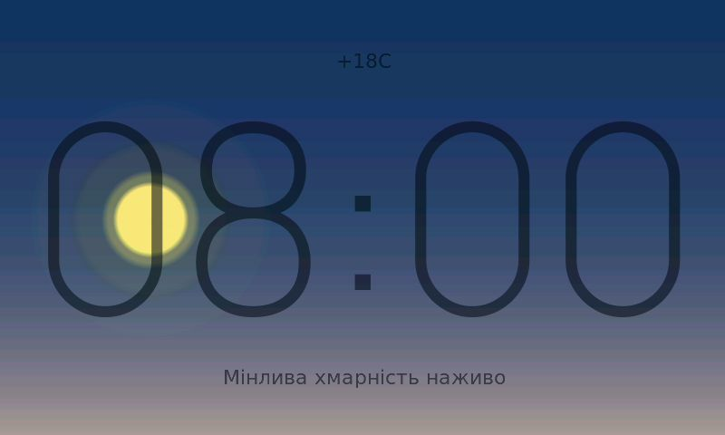
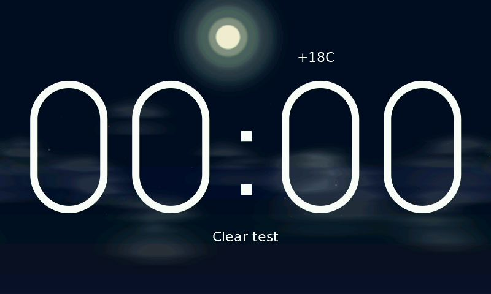
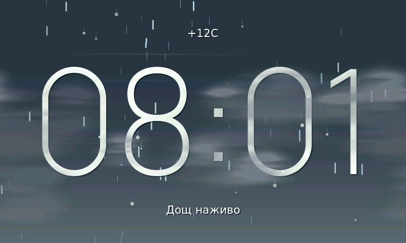

# eva_wthr

Weather-only firmware for the Guition `JC4880P443C_I_W` board (ESP32-P4 main MCU + ESP32-C6 hosted Wi-Fi).

On boot it goes straight into a **native 800×480 procedural weather scene** — no menu, no legacy “eyes” demo. The clock, temperature, date, and description come from live weather fetches; everything else (sky, clouds, sun, rain, glass) is drawn in real time on the CPU/PPA pipeline.

## How It Looks Now

Think of it as looking through a window at the weather outside.

**Centre stack**
- **288 px extralight clock** (Manrope-based `eva_font_clock_288_extralight`) — always horizontally centred
- **Date + temperature** in the upper band (centred, or shifted sideways if the sun halo would overlap)
- **Weather description** in the lower band (Ukrainian-capable `eva_font_uk_22`)

**Sky & sun**
- **Radial sky gradient** centred on the sun: warm light pools around the sun's azimuth over a vertical horizon-biased base, instead of flat horizontal bands
- **Smooth day↔night transition**: the palette ramps twilight→night over the real civil-twilight window (longer in summer), so dusk fades gradually instead of snapping to a flat night colour at sunset
- Sun or moon follows a day arc: low at sunrise/sunset, high near solar noon, with a **seasonal apex** (lower in winter, higher in summer)
- After sunset the sun **sinks below the bottom edge** through a short glide window and rises back at dawn, rather than popping off at the horizon
- **Sunset colour tracks cloud cover** (vivid orange when clear, muted grey when overcast) and shifts subtly by day-of-year (redder winter dusks, more golden in summer)
- Sun disc and glow use **Fibonacci radii** (42 px disc, rings at 55 / 89 / 144 px)
- A **per-frame animated halo** breathes on outer rings (89 / 144 / 233 px) with eight slow soft rays

**Clouds**
- Three scrolling layers (high cirrus → mid cumulus → low base), hardware-blended via PPA
- Clouds composite **over** the text so thin edges can partially cover the clock — reads as depth, not a HUD pasted on top

**Precipitation & storms**
- Outdoor rain, snow, sleet, hail, and fog particles sit **behind the window**
- Thunderstorms add a full-screen flash plus a jagged bolt

**Glass overlay (top layer)**
- During rain: droplets **form**, start slow, accelerate with drag, leave a short wet trail, then dry
- Outdoor streaks stay outside; glass beads and soft specular sparkles sit on the pane in front of everything

### Render order (bottom → top)

```text
cached sky + sun/moon disc
  → animated sun halo (every frame)
  → outdoor rain / snow / lightning
  → text (clock, date, temp, description)
  → clouds (HIGH → MID → LOW)
  → glass (droplets + glints)
```

## Screenshots

Captured on real hardware after flashing the current `main` branch (`CDC screenshot`, 800×480).

| Partly cloudy | Clear day | Rain |
| --- | --- | --- |
|  |  |  |
| Layered clouds, warm sun behind the clock, date/temp above | Larger Fibonacci sun with pulsing halo rings | Outdoor streaks behind the pane; beads and trails on the glass |

## What's New Since the First GitHub Release

The first public commit (`65c2e5f`) already had the working P4+C6 weather stack. The current build (`b0bebe4` and later) is a major visual and compositing refresh:

| Area | First release | Current |
| --- | --- | --- |
| Clock | 144 px extralight | **288 px** extralight (`eva_font_clock_288_extralight.c`) |
| Sun | ~21 px disc, static 89 px halo | **42 px disc**, glow 55→89→144 px, **animated** outer halo every frame |
| Text vs clouds | Text on top of clouds | Text **under** clouds (PPA blend occludes it naturally) |
| Rain | Single outdoor particle layer | Outdoor rain **+** glass droplets with forming / slide / trail / dry physics |
| Sun vs top text | Always centred | Date/temp **shift away** from the sun when the halo overlaps the top band |
| Glass glints | — | Soft fixed sparkles on the pane (no rotating lens-flare beam) |
| Layer order | Simpler stack | Explicit z-order: sky → halo → outdoor FX → text → clouds → glass |
| Moon | Smaller disc | **2×** radius to match the larger sun |
| Sky gradient | Flat horizontal bands | **Radial**, warm light pooled around the sun's azimuth |
| Dusk | Snapped to night at sunset | **Smooth** twilight→night ramp over the civil-twilight window |
| Sun/moon set | Popped off at the horizon | **Sinks below** the bottom edge and rises back at dawn |
| Backlight | Fixed `[01:00, 06:00)` dim | **Sun-driven ramp** 100 %↔10 % around real sunset/sunrise |
| Wi-Fi recovery | Gave up after N retries | **Indefinite** reconnect with exponential backoff |

Removed for stability/FPS: full-screen sky glare scan and heavy static god-ray passes (they caused visible hitches on clear days).

## What This Firmware Does

- Boots directly into the animated 800×480 scene described above.
- Uses the ESP32-C6 as hosted Wi-Fi through `esp_hosted`.
- Fetches weather from Open-Meteo and Clear Outside.
- Syncs time over HTTP Date headers instead of SNTP, because SNTP was unstable on this hosted Wi-Fi stack.
- **Reconnects Wi-Fi indefinitely with exponential backoff** (fast retries first, then 2→60 s) so the display recovers on its own when the AP comes back, instead of giving up after a fixed retry count.
- **Ramps the backlight by the real sun times**: full brightness by day, easing down to 10 % over the 3 hours after sunset, holding through the night, and back to 100 % over the hour before sunrise (falls back to a fixed `[01:00, 06:00)` dim schedule until time syncs).
- Stores timezone and last weather state in NVS.
- Exposes a TinyUSB CDC console for status, testing, screenshots, and manual weather overrides.
- Includes the board support components and tuned `sdkconfig.defaults` needed for this hardware.

It does not include the older "eyes" scene. This repository is the weather firmware only.

## Naming Note

This repository folder is named `eva_wthr`, but the original project name was **Eva**. Firmware, binary, logs, and CDC commands still use `eva_weather`, `eva_*`, and `Eva WEATHER` — left unchanged because that is what the board expects.

## Hardware

Tested on:

- Board: Guition `JC4880P443C_I_W`
- Main MCU: `ESP32-P4`
- Wi-Fi coprocessor: `ESP32-C6`
- Display: 800x480 RGB/MIPI panel through the vendor BSP
- Flash config used here: 16 MB, QIO
- USB: TinyUSB CDC on the P4

Important P4+C6 hosted Wi-Fi settings are already in `sdkconfig.defaults`:

- `CONFIG_ESP_HOSTED_ENABLED=y`
- `CONFIG_ESP_HOSTED_IDF_SLAVE_TARGET="esp32c6"`
- SDIO pins: CMD `19`, CLK `18`, D0 `14`, D1 `15`
- C6 reset GPIO: `54`
- SDIO clock: `40000` kHz

## Required Toolchain

Use ESP-IDF `v5.5.4`.

```sh
cd /path/to/eva_wthr
source "$HOME/.espressif/v5.5.4/esp-idf/export.sh"
idf.py set-target esp32p4
idf.py build
```

The app binary is generated as:

```text
build/eva_weather.bin
```

## Configure Your Device

Before flashing, set your Wi-Fi and location.

Fast path:

```sh
idf.py menuconfig
```

Then open:

```text
Eva Weather
```

Set:

| Option | Default | Meaning |
| --- | --- | --- |
| `CONFIG_EVA_WIFI_SSID` | `YOUR_WIFI_SSID` | Your Wi-Fi network name (2.4 GHz). |
| `CONFIG_EVA_WIFI_PASSWORD` | `YOUR_WIFI_PASSWORD` | Your Wi-Fi password. |
| `CONFIG_EVA_WEATHER_LATITUDE` | `50.447914` | Latitude for Open-Meteo and Clear Outside. |
| `CONFIG_EVA_WEATHER_LONGITUDE` | `30.522192` | Longitude for Open-Meteo and Clear Outside. |

The Wi-Fi defaults are placeholders, so the shipped firmware will not connect
until you set your own. Edit them in `menuconfig` (above), or pin them for
reproducible builds by **adding** these lines to `sdkconfig.defaults` before the
first build (they are not there by default):

```text
CONFIG_EVA_WIFI_SSID="your-network"
CONFIG_EVA_WIFI_PASSWORD="your-password"
CONFIG_EVA_WEATHER_LATITUDE="50.447914"
CONFIG_EVA_WEATHER_LONGITUDE="30.522192"
```

The coordinate defaults point to central Kyiv.

The default timezone is stored in `main/eva_settings.c`:

```c
EET-2EEST,M3.5.0/3,M10.5.0/4
```

That is Ukraine summer/winter time. You can change it at runtime from the CDC console:

```text
tz UTC0
tz EET-2EEST,M3.5.0/3,M10.5.0/4
```

The value is saved to NVS.

## Flash

Automatic flash from the project root:

```sh
./flash.sh
```

Or pass the current runtime CDC port:

```sh
./flash.sh /dev/cu.usbmodem1234561
```

The script toggles DTR/RTS on the running CDC port, waits for the ROM USB port, then flashes with:

```sh
python -m esptool --chip esp32p4 -p <ROM_PORT> -b 460800 \
  --before no_reset --after hard_reset write_flash @flash_args
```

Manual recovery if auto-flash does not catch the port:

1. Hold `BOOT`.
2. Tap `RST`.
3. Release `BOOT`.
4. Find the ROM port:

```sh
ls /dev/cu.usbmodem*
```

5. Flash from the build directory:

```sh
cd build
python -m esptool --chip esp32p4 -p /dev/cu.usbmodem21101 -b 460800 \
  --before no_reset --after hard_reset write_flash @flash_args
```

## First Boot Check

Open the monitor:

```sh
idf.py -p /dev/cu.usbmodem1234561 monitor
```

Expected boot banner:

```text
Eva WEATHER v1 built <date> <time>
```

Useful console commands:

```text
whoami
status
perf
time
tz
clockoffset <hours>
weather
weather refresh
screenshot
log info
```

`whoami` should return:

```text
weather
```

`status` shows Wi-Fi, time, and weather fetch state. `perf` prints render timing. `weather refresh` forces both weather providers to fetch immediately.

## Manual Weather/Test Commands

Set a simple weather state:

```text
weather rain 12 "Test rain"
weather cloudy 8 "Cloudy"
weather thunderstorm 18 "Storm"
```

Supported weather kinds:

```text
clear-day
clear-night
partly-cloudy-day
partly-cloudy-night
cloudy
fog
rain
heavy-rain
snow
thunderstorm
sleet
hail
```

Set raw cloud/precipitation fields:

```text
weatherraw <low> <mid> <high> <total> <fog> <precip> <mm_x10>
```

Example:

```text
weatherraw 20 60 90 85 0 3 12
```

Debug deterministic render variants:

```text
weatherdebug rain 42
clockoffset 3
wind -40
wind clear
```

`frame` works as a repeatable seed for cloud variation. `clockoffset` only shifts the visual scene and clock; it does not rewrite the saved timezone. `wind <signed_kph>` is a temporary renderer override for checking both drift directions.

## Important Files

| Path | Purpose |
| --- | --- |
| `main/main.c` | App entry, CDC command handling, test panel. |
| `main/eva_weather_canvas.c` | Procedural renderer: sky, clouds, sun, particles, text, glass. |
| `main/eva_font_clock_288_extralight.c` | 288 px clock font (Manrope ExtraLight). |
| `main/eva_wifi.c` | Hosted Wi-Fi setup, backoff reconnect, and HTTP time sync. |
| `main/eva_clock.c` | Clock task: time/date strings + sun-driven backlight ramp. |
| `main/weather_fetch.c` | Dual-source weather coordinator. |
| `main/weather_fetch_openmeteo.c` | Open-Meteo API provider. |
| `main/weather_fetch_clearoutside.c` | Clear Outside HTML provider. |
| `main/eva_settings.c` | NVS timezone default and persistence. |
| `main/Kconfig.projbuild` | User-editable Wi-Fi/location project config. |
| `sdkconfig.defaults` | Known-good P4+C6/LVGL/TinyUSB/hosted-Wi-Fi defaults. |
| `partitions.csv` | Partition table. |
| `flash.sh` | Auto-flash helper for the P4 USB CDC/ROM port flow. |
| `tools/eva-screenshot.py` | Screenshot helper through CDC. |
| `tools/cdc_shoot.py` | Batch CDC helper for clock offsets, weatherdebug, and screenshots. |

## Notes For GitHub Users

- Do not commit your real Wi-Fi credentials in `sdkconfig`, `sdkconfig.defaults`, or source code.
- `sdkconfig.defaults` is the useful baseline for this exact board.
- If you regenerate `sdkconfig`, keep the hosted Wi-Fi, PSRAM, TinyUSB, and P4 revision settings unless you know your board differs.
- If the board reboots when a serial tool connects, it is usually DTR/RTS line-state behavior. Reconnect or use manual `BOOT` + `RST` flashing.
- The weather APIs used here do not require an API key.
