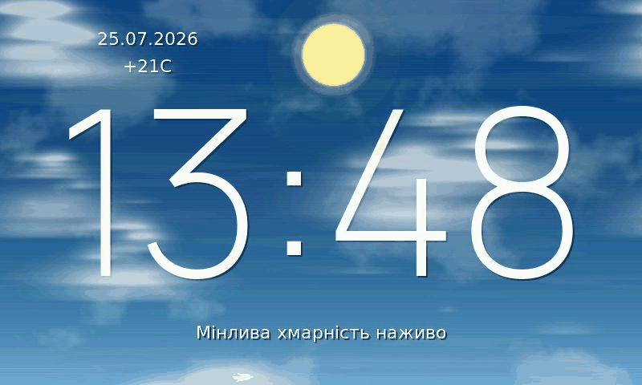
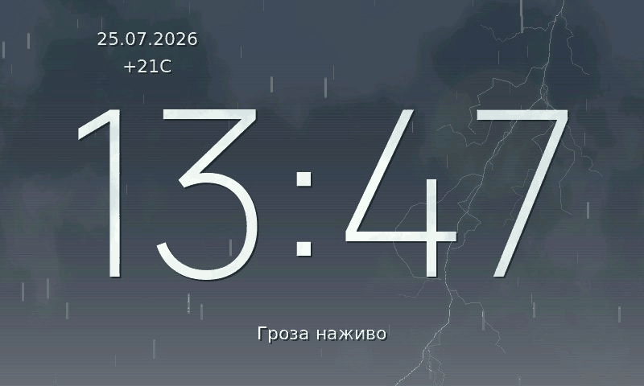
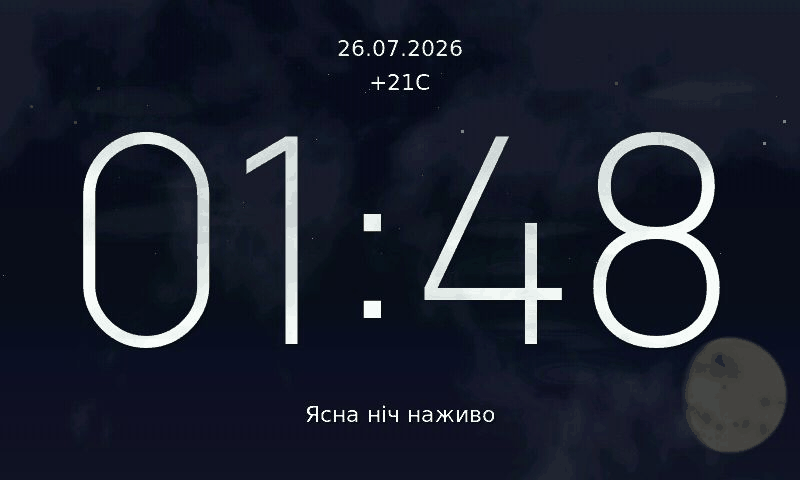
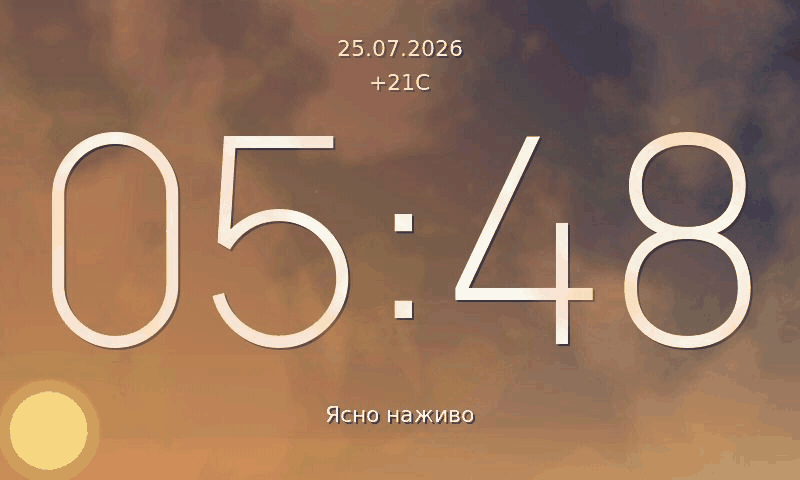

# Eva Weather Firmware

Weather-display firmware for the Guition **JC4880P443C_I_W** board
(ESP32-P4, ILI9881C 480×800 MIPI-DSI panel). It boots straight into a
native weather canvas: a procedural sky with pre-baked, animated cloud
layers, sun/moon, precipitation, and lightning — driven by live weather
over hosted Wi-Fi.

## Current look

| Moving clouds | Rain + lightning |
|---|---|
|  |  |

| Moon at night | Sunrise |
|---|---|
|  |  |

## Features

- Native 800×480 landscape render, PPA-rotated to the portrait panel.
- **Pre-baked cloud masks** generated offline (`tools/cloudgen/`) and
  shipped as an LZ4 pack (`assets/clouds.bin`) mmap'd from a raw flash
  partition — no on-device generation, no frame stalls. Storm scenes use
  a separate cloud pool.
- Three parallax cloud layers with slow morph, wind drift, and depth
  "breathing"; seamless horizontal tiling.
- Time-of-day sky palette (day → sunset → night → sunrise) with Bayer
  dithering, independent sun and moon, god rays, night backlight dim.
- Rain / heavy-rain / snow / sleet / hail particles; lightning composited
  over the cloud deck in thunderstorms.
- Hosted Wi-Fi + HTTP time sync, NVS timezone, TinyUSB CDC debug console,
  screenshot capture.
- **OTA updates over Wi-Fi** (`tools/ota.py`) with content hashing, so only
  the artifacts that actually changed are transferred — an untouched 7.6 MB
  cloud pack costs one HTTP request instead of a minute of upload. Dual app
  slots with bootloader rollback; a corrupted pack self-heals.

For the history of what has been built and what is still planned, see
[`docs/DONE.md`](docs/DONE.md) and the pending specs/plans under
`docs/superpowers/`.

## First-time setup

Everything site-specific lives in `menuconfig` — no source edits needed.

```sh
source "$HOME/.espressif/v5.5.4/esp-idf/export.sh"
idf.py menuconfig       # → "Eva Weather"
```

| Setting | What it does |
|---|---|
| `EVA_WIFI_SSID` / `EVA_WIFI_PASSWORD` | Your 2.4 GHz network. The radio is a **hosted ESP32-C6 over SDIO**, not a native P4 radio — the C6 must already be flashed with matching `esp_hosted` slave firmware. |
| `EVA_WEATHER_LATITUDE` / `EVA_WEATHER_LONGITUDE` | Decimal degrees (north/east positive). Used by **both** weather providers, so they always describe the same place. |

Settings land in `sdkconfig`, which is **not** committed — your credentials
stay local. Never hardcode them in `main/eva_wifi.c`.

### Things that surprise people

- **Timezone is separate from location.** It is a POSIX TZ string kept in
  NVS, not derived from the coordinates. Default is Kyiv/Kiev
  (`EET-2EEST,M3.5.0/3,M10.5.0/4`). Change it at runtime over CDC:
  `tz CET-1CEST,M3.5.0,M10.5.0/3`. It survives reboots.
- **The panel needs ~30 s of network before the first live weather.** Wi-Fi
  init is deliberately delayed ~10 s (the hosted C6 needs to settle), then
  the first fetch waits another ~15 s. Until then the screen shows the last
  weather restored from NVS, so a fresh board briefly shows placeholder
  data.
- **The clock is HTTP-based, not SNTP.** SNTP over the hosted stack reset
  the board, so time comes from the `Date:` header of a plain-HTTP request
  (google / cloudflare / example.com, whichever answers), re-synced every
  6 h. Before the first sync the clock counts from 00:00 — that is uptime,
  not real time.
- **Latitude is also compiled into the sky model.** The twilight/sun-height
  palette uses `EVA_OBSERVER_LAT_DEG` in `main/eva_sky_palette.h`, a
  compile-time float (menuconfig has no float type, and this is read every
  frame). If you move far in latitude, set it to match your config value.
  A few degrees of drift only shifts twilight timing slightly.
- **Cloud assets are a separate 11 MB flash partition.** `assets/clouds.bin`
  is flashed alongside the app. If it is missing or corrupt the firmware
  falls back to slower procedural cloud generation instead of failing.

## Build

Use ESP-IDF **v5.5.4** for this project (not 5.4 — the Python env check
will complain).

```sh
source "$HOME/.espressif/v5.5.4/esp-idf/export.sh"
idf.py build            # app → build/eva_weather.bin, pack → assets/clouds.bin
```

Host-side tests for the pure logic (no hardware needed):

```sh
sh tools/run_tests.sh
```

To change the cloud look, edit `PROFILES` in `tools/cloudgen/cloudgen.py`,
regenerate, review the preview, then rebuild:

```sh
python tools/cloudgen/genpool.py     # regenerates assets/clouds.bin
python tools/cloudgen/preview.py     # contact sheet for visual approval
```

## Flash (automatic)

From `phase7_eva_weather`:

```sh
./flash.sh                       # or ./flash-weather.sh from 42_EVE_FW
./flash.sh /dev/cu.usbmodem1234561   # pass a known runtime CDC port
```

`flash.sh` opens the runtime CDC port, toggles DTR/RTS to enter ROM
download mode, waits for the ROM USB port, then runs
`esptool ... write_flash @flash_args`.

## Update over Wi-Fi (no cable)

Once the OTA-capable firmware is on the panel, the cable is only ever needed
again if you change the partition table.

```sh
python3 tools/ota.py --host eva-weather.local
```

It builds, asks the device what it already has, and sends **only what
changed**. Useful flags:

| Flag | Effect |
|---|---|
| `--no-build` | use `build/` as-is |
| `--dry-run` | print the diff, send nothing |
| `--app-only` / `--pack-only` | restrict what may be sent |
| `--force` | send even when hashes match |
| `--host <ip>` | skip mDNS (see the note below) |

Typical output when only the firmware changed:

```text
device  eva-weather.local  fw 20260801T…  slot ota_0 (valid)
app   13cb605e… -> 799feac5…  CHANGED    1.58 MB
pack  38651994… == 38651994…  unchanged  (skip 7.60 MB)
```

Exit codes: `0` updated / already current, `1` transfer failed, `2`
unreachable, `3` build failed, `4` the device rolled back.

### How it decides what changed

The device records the SHA-256 the **host** said it sent, in NVS — it never
recomputes a hash from flash. A flashed image is not byte-identical to the
`.bin` file (image headers, padding), so a device-side hash would mismatch
forever and re-send 7.6 MB on every run. The cost of this design is one
redundant transfer on the very first update; after that it is exact.

### Safety properties

- **Verify before commit.** The SHA is checked *before*
  `esp_ota_set_boot_partition()`, so a truncated upload can never become
  bootable. A bad hash returns HTTP 400 and leaves the device untouched.
- **Rollback.** `CONFIG_BOOTLOADER_APP_ROLLBACK_ENABLE=y`. A new image must
  pass a self-check — Wi-Fi back up *and* the render loop producing frames —
  or the bootloader reverts on the next reset. Wi-Fi is the gate that matters:
  without it no further update could be pushed.
- **The cloud pack is written in place** (two 7.6 MB copies do not fit), which
  is safe because the canvas has a real "no pack" mode: readers are quiesced
  first and clouds fall back to procedural generation during the write.
- **Power loss mid-pack-write self-heals.** The pack fails to parse at boot,
  the panel renders procedurally, the stored hash is cleared, and the next
  `ota.py` run re-sends the pack automatically. No cable, no manual step.

### Partition layout

OTA needs two app slots, so the table changed — **flash it once over USB**,
after which updates are wireless:

```text
otadata  0x10000  0x2000
ota_0    0x20000  0x280000   (2.5 MB; app is ~1.6 MB)
ota_1   0x2A0000  0x280000
storage 0x520000  0xAE0000   (10.875 MB; pack is 7.60 MB)
```

The cloud pack now lives at **`0x520000`** (it used to be `0x410000`) — any
older `esptool read_flash` recipe needs updating.

### mDNS caveat

The panel advertises `eva-weather.local` and an `_eva-ota._tcp` service, but
hostname resolution proved unreliable on at least one network. If
`eva-weather.local` does not resolve, pass `--host <ip>`. Find the address
with the CDC `otainfo` command or `arp -a | grep espressif`.

### No authentication

The update endpoints are plain HTTP with no auth — anyone on the same LAN can
flash the device. That is a deliberate choice for a home network; add a shared
secret before putting this on a network you do not control.

## Flash recovery (manual BOOT+RST)

Use this if the runtime CDC port is unstable or missing.

1. Hold `BOOT`, tap `RST`, release `BOOT`.
2. Flash from `build/`:

```sh
python -m esptool --chip esp32p4 -p /dev/cu.usbmodemXXXX -b 460800 \
  --before no_reset --after hard_reset write_flash @flash_args
```

Find the port with `ls /dev/cu.usbmodem*`.

## Smoke test after flash

Open a monitor on the runtime CDC port (`idf.py -p /dev/cu.usbmodemXXXX
monitor`) and run:

```text
whoami        # → weather
status        # Wi-Fi / time / weather state
perf          # render + cloud timings
cloudinfo     # active cloud pool per layer
weather refresh
```

## CDC commands

```text
whoami                 time            tz [<posix-tz>]
clockoffset <hours>    status          perf
weather                weather <kind> <temp_c> "Description"
weather refresh        weatherraw <low> <mid> <high> <total> <fog> <precip> <mm_x10>
weatherdebug <kind> <frame>            cloudinfo
weatherpin on|off      transition <ms> cloudvolume
lightning              screenshot      log [<level>]
wind <signed_kph>|clear
otainfo                otaserver on|off
otavalidate            otarollback     otaclearhash app|pack|all
```

`<kind>`: `clear-day clear-night partly-cloudy-day partly-cloudy-night
cloudy fog rain heavy-rain snow thunderstorm sleet hail`

- `clockoffset` temporarily shifts the visual scene + clock; it does not
  rewrite the NVS timezone.
- `weatherdebug` uses `frame` as a repeatable seed for cloud variation.
- **Scene changes ease over ~15 s.** A `weatherdebug` right before a
  screenshot captures the *old* scene mid-morph. Use `transition 0` for
  instant switching while testing, then `transition 15000` to restore.
- `weatherpin on` stops live fetches from overwriting a debug scene —
  without it a pinned demo reverts within minutes.
- `lightning` forces a strike (thunderstorm/hail only).
- `perf` reports `vsync_timeouts`: frames where the panel had not finished
  scanning within 40 ms, so the buffer swap was skipped. Should be 0.
- `otainfo` prints the IP, mDNS name, recorded hashes and running slot — the
  "where is my device" command when mDNS is not cooperating.
- The `ota*` commands are debugging conveniences, **not** the update path:
  sending them needs the USB cable that OTA exists to eliminate. Use
  `tools/ota.py` to actually update.
- `otaclearhash` forces the next `ota.py` run to re-send that artifact.
- **CDC gotcha:** do not call `reset_input_buffer()` right after opening the
  port in your own scripts — the panel then appears to answer nothing.

### Capturing screenshots and GIFs

```sh
python tools/cdc_shoot.py out/ 0 clear-day thunderstorm    # stills
python tools/cdc_animate.py docs/images/x.gif thunderstorm \
       --frames 24 --lightning                             # animation
```

Both grab the 800×480 landscape render buffer, so the JPEG/GIF already
reads the right way up — no host-side rotation needed for this path.

### Serial port note

This firmware uses CDC line-state transitions to auto-enter the
bootloader. Some serial tools toggle RTS/DTR on connect/disconnect, which
can reboot the board; reconnect and continue, or use manual BOOT+RST
recovery flash.
